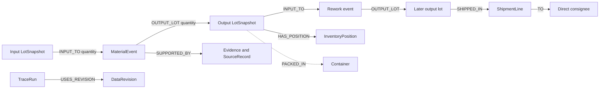

# RecallRadius technical blueprint

Build target: one-day hackathon demonstration, followed by a bounded paid pilot. Research checked September 12, 2026. This is an implementation proposal. Only the accompanying Python reference case has been executed; the application, Neo4j queries and runtime AI below have not been built or tested.

## Product contract

Given a reviewer-confirmed suspect ingredient lot and a defined investigation scope, find recorded downstream material relationships, distinct inventory positions and outbound shipment lines. Show missing records and preserve each result as an immutable run. The operational output is a candidate investigation/hold list for QA, not an automated recall or a safety clearance.

Start with one U.S. food co-packer site, multiple customer brands, actual production and rework records, and four controlled input formats. Avoid general ERP replacement, network-wide supplier onboarding, autonomous notifications and arbitrary document understanding.

The primary research and commercial reasoning are in [RESEARCH_REPORT.md](RESEARCH_REPORT.md). The graph design draws on [GS1 EPCIS](https://ref.gs1.org/standards/epcis/2.0.1/), but the proposed internal format does not claim EPCIS conformance.

## Essential stack

| Component | Choice and role |
| --- | --- |
| Development | Qoder IDE, with accepted edits and meaningful test work recorded for judges |
| Application | Next.js, TypeScript, server Route Handlers |
| Validation | Zod, controlled units and deterministic import checks |
| Graph | Neo4j Aura, accessed only by the server through the official JavaScript driver |
| Runtime AI | One interchangeable schema-output adapter for an alert or mapping proposal; manual fallback |
| Files | Server-side original source files with hashes and row locators for a local synthetic demo |
| Tests | Vitest for application rules and actual Neo4j integration tests against the reference cases |
| Optional | Read-only Neo4j MCP for developer inspection of synthetic records |

Defer deployment-provider choice, OCR, vector search, GraphRAG, autonomous agents, blockchain, IoT ingestion and a full EPCIS server. These are not required to prove the product.

## Input contracts

Every import has `workspaceId`, `sourceSystem`, `importId`, `sourceHash`, `schemaVersion`, `receivedAt` and a review state. Original files are retained according to the workspace policy. Rows retain a stable locator. The server obtains the workspace from the authenticated session; it does not trust a browser-supplied tenant identifier.

| Format | Required fields for the demo |
| --- | --- |
| Lot master / opening positions | issuer/source, item identifier, original lot code, internal lot ID, kind, site, opening quantity, unit, cutoff, origin status, evidence ID |
| Event allocations | event ID, event time, recorded time, event type, direction (`input` or `output`), lot ID, quantity, unit, evidence ID |
| Shipment lines | shipment line ID, lot ID, quantity/unit, dispatch time, direct consignee ID, brand ID, source record |
| Other movements | movement ID, lot ID, movement type (receipt, disposal, return, adjustment), quantity/unit, time, site, evidence and review status |

Event-allocation rows are grouped into a complete canonical event before acceptance. A missing input or output makes the event incomplete. Exact repeated events are idempotent; a reused event ID with different content is a conflict needing review. Never append every CSV row as a new event on every import.

Business identity should use a reviewed combination of source/issuer, item and external lot code, with date or other disambiguators when needed. Do not automatically join every occurrence of `T17` across suppliers. A fuzzy name match is a proposal. Preserve the actual external code and source fields alongside internal UUIDs; see [FDA lot-code guidance](https://www.fda.gov/food/food-safety-modernization-act-fsma/traceability-lot-code).

For an MVP, permit only kilograms and processes whose explicit inputs, outputs and waste reconcile. Pilot ingestion needs approved unit conversions, measured process losses and yields. Do not convert cases to kilograms without an approved, item-specific pack configuration and relevant date.

Source coverage is a first-class record. Store which sites, date ranges and record categories the importer expected, what arrived, how many rows were rejected, and whether a reviewer accepted completeness. Matching supplied rows is not proof that all relevant rows were supplied.

## Graph model



Container relationships are excluded from material traversal. The same applies to brand, supplier, site and SKU relationships. These can filter or explain results without making every related item a material descendant.

Recommended nodes:

| Node | Important properties |
| --- | --- |
| `DataRevision` | ID, workspace, sequence, accepted time, source hashes, reviewer, completeness manifest |
| `LotSnapshot` | workspace/revision, stable lot ID, external identity, kind, site, origin review status |
| `MaterialEvent` | workspace/revision, event ID, type, event time, recorded time, evidence IDs |
| `InventoryPosition` | stable position ID, lot ID, site/bin, quantity/unit, cutoff and ledger basis |
| `ShipmentLine` | stable source line ID, lot ID, quantity/unit, dispatch time, consignee and source record |
| `Evidence` | file hash, record locator, extracted span or original row, reviewer and acceptance |
| `TraceRun` | immutable ID, root IDs, workspace, data revision, engine version, scope, cutoff, result digest, completion state |
| `ReviewDecision` | actor, time, subject, decision, reason, evidence and scope/run reference |

For the small demo, duplicate the projection per accepted revision. This trades storage for simple and reliable history. Keep stable logical lot IDs separate from projection identities. A later pilot can use an append-only event store with reproducible projections after measuring its needs.

A proposed Neo4j uniqueness constraint is:

```cypher
CREATE CONSTRAINT lot_snapshot_identity IF NOT EXISTS
FOR (l:LotSnapshot)
REQUIRE (l.workspaceId, l.revisionId, l.lotId) IS UNIQUE;
```

Create analogous identities for events, positions, lines and runs. Reject null required fields at ingestion; uniqueness alone does not enforce their presence or authorize access. See [Neo4j constraints](https://neo4j.com/docs/cypher-manual/current/schema/constraints/create-constraints/).

For a future EPCIS adapter, preserve transformation groups. Multiple records with the same transformation identifier can belong to one effective process; either normalize that group with all required inputs and outputs or classify it as unsupported/incomplete. Do not silently treat each fragment as a complete independent event. Internal event IDs and lot-version IDs must not overwrite external regulatory identifiers.

## Deterministic trace algorithm

1. Resolve the root against accepted business identities. If ambiguous, stop for review.
2. Freeze the accepted data revision, engine version, site/time scope, inventory cutoff and QA exposure assumptions.
3. Run schema, chronology, stock and coverage checks. Do not discard failed imports and then call the remaining graph complete.
4. Traverse input lot -> material event -> output lot. Use a visited set of logical lot IDs within the revision, retain witnesses, and conservatively include each output of an affected process.
5. Independently scan the entire selected cohort for missing origins, missing records and unreconciled movements. Follow known descendants of uncertain origins as review candidates.
6. Keep `knownMaterialPath` and `hasUnresolvedEvidence` as independent flags. A lot can have both.
7. Resolve distinct inventory position and shipment-line IDs. Aggregate each once, separately by disposition and compatible unit.
8. Save the complete result and evidence references as a new immutable TraceRun. A changed record or scope produces a new run.

One fixed, parameterized expansion query can underpin a server-side frontier loop:

```cypher
UNWIND $frontier AS inputId
MATCH (i:LotSnapshot {
  workspaceId: $workspaceId, revisionId: $revisionId, lotId: inputId
})-[:INPUT_TO]->(e:MaterialEvent)-[:OUTPUT_LOT]->(o:LotSnapshot)
WHERE e.workspaceId = $workspaceId AND e.revisionId = $revisionId
  AND o.workspaceId = $workspaceId AND o.revisionId = $revisionId
RETURN DISTINCT i.lotId AS inputLotId, e.eventId AS eventId,
                o.lotId AS outputLotId;
```

This is proposed query text, not a database-verified implementation. Record every returned witness even when its output has already been visited; expand each newly seen output once. Keep explicit query/time budgets. Exceeding a budget returns an incomplete run and the reason; it must not return a complete-looking partial answer. An accepted revision must be immutable for the duration of the loop.

Limit incident scope deliberately. A missing edge may connect records outside the selected date/site envelope; show that boundary and let QA broaden it. The server should never interpret absence of a path as global safety evidence.

Quantity calculation is ledger-based:

```text
closing stock = accepted opening + receipts + production outputs + returns
                - production inputs - outbound shipments - disposal
                + signed, reviewed adjustments
```

Only combine quantities sharing a valid unit conversion and cutoff. Keep historical shipments even when goods are later returned; current stock and customer communication history are different measures. Never add intermediate batch quantities to descendant finished quantities as if both were currently present.

Possible cross-contact needs separate case-specific records and a QA-defined exposure policy. It should not be approximated by allowing arbitrary graph edges into the ingredient traversal. In the MVP, display that it is outside the material genealogy assessment and allow an unresolved scope note.

## Runtime AI contract

One narrow feature is sufficient: paste a supplier alert, propose the supplier, item, lot code and stated dates, then ask the user to match that proposal to known lot identities. Another useful pilot feature is column mapping. Start with one, not both.

```ts
type AlertDraft = {
  supplier: string | null;
  item: string | null;
  externalLotCode: string | null;
  statedDateRange: { from: string; to: string } | null;
  evidence: Array<{
    field: string;
    sourceId: string;
    startOffset: number;
    endOffset: number;
    exactText: string;
  }>;
  unresolvedFields: string[];
};
```

Use a strict schema; validate that cited spans actually occur in the supplied source. Preserve nulls instead of guessing. Reject out-of-range offsets and invented lot identities. Prompt the model to treat all source content as untrusted data. No model tool has permission to send notices, change holds, create accepted relationships or execute arbitrary database queries.

The human review state is `draft -> confirmed` or `draft -> rejected`. Confirmation includes the matched canonical lot ID and reviewer. A structured-output API reduces format errors; it does not guarantee factual correctness. See [Google's structured-output guidance](https://ai.google.dev/gemini-api/docs/structured-output).

Keep the adapter replaceable and use an existing funded API if available. Qoder IDE credits should not be assumed to fund the application's inference endpoint. Call the model outside managed database transaction callbacks, which can be retried; see [Neo4j transactions](https://neo4j.com/docs/javascript-manual/current/transactions/).

## Proposed endpoints and screens

| Endpoint | Purpose |
| --- | --- |
| `POST /api/imports/preview` | Parse controlled formats, calculate hashes and report errors without accepting a revision |
| `POST /api/imports/:id/accept` | Record reviewer acceptance and create a validated, immutable projection |
| `POST /api/alerts/extract` | Return an untrusted, schema-validated draft with source spans |
| `POST /api/incidents/:id/traces` | Validate scope, run deterministic tracing and store a frozen result |
| `GET /api/traces/:id` | Return quantities, paths, unresolved records and completion status |
| `GET /api/traces/:id/compare?other=...` | Compare compatible scopes and label data/scope changes separately |
| `GET /api/traces/:id/export` | Export the reviewed investigation table and provenance, not a compliance certificate |

Use four screens: (1) source import and review, (2) result table with evidence drawer, (3) unresolved queue, (4) revision comparison. The primary table columns are status, lot, product/brand, onsite quantity, shipped quantity, direct consignees, evidence and next review action. Keep graph exploration secondary.

Candidate actions should read "QA review: consider hold" or "Verify missing production record." Operational hold state must only be shown as applied if a verified source system or approved human action establishes that fact.

## Executable reference case

Run `reference_case.py` with Python 3. It uses the standard library and writes JSON results and a shipment CSV to `reference_output/`. It has been executed successfully in this workspace.

```text
python reference_case.py
```

| Checkpoint | Revision 1 | Revision 2 |
| --- | --- | --- |
| Onsite potential-impact stock | 160 kg | 190 kg |
| Shipped quantity with recorded path | 120 kg | 180 kg |
| Distinct direct consignees | 3 | 4 |
| Unresolved finished stock | 40 kg onsite; 60 kg shipped | 0 in the complete fixture |
| Already disposed | 10 kg | 10 kg |
| F-D, sharing a pallet only | No recorded material path | No recorded material path |

Revision 2 consumes 10 kg previously shown as WIP and adds 40 kg of finished stock to the material path. Therefore the onsite change is +30 kg. The previous result is preserved. The late record is a past physical event recorded later, not production occurring after the investigation.

The fixture's R-UNK opening 20 kg is explicitly provisional. It balances the known E6 consumption without proving its source. Do not present this quantity as a verified receipt or silently materialize an invented origin edge.

All 22 executed checks are listed in `reference_output/verification.json`. They include identity conflicts for events, duplicate paths and shipment lines, ordering, cycles, unknown origins and a known-path/unknown-origin overlap. They do not validate real-world correctness, tenant isolation, general measurements or Neo4j performance.

## Application acceptance and adversarial cases

Before the hackathon submission, run the reference expectations against the actual graph/API, not just the Python code. Add the following application-specific cases:

| Case | Required outcome |
| --- | --- |
| Two suppliers both label a lot T17 | Identity review or distinct canonical lots; no automatic cross-supplier join |
| Another workspace's lot ID is submitted | Access denied and no data leakage |
| Missing file or dropped shipment row | Coverage exception; run not presented as complete |
| Decimal weights, pack changes, moisture loss | Approved conversion/yield or explicit review, never silent arithmetic |
| A graph query times out | Incomplete state with reason; no definitive empty result |
| Upload includes instructions to ignore rules | Treated as source text; no tool execution or accepted data change |
| Model fabricates an evidence span | Proposal rejected or flagged for correction |
| Exact source file imported twice | Idempotent acceptance or explicit already-imported result |
| Evidence is corrected after a run | New revision and run; previous result remains reproducible |
| Customer returns a shipment | Current stock changes; original outbound history remains visible |
| Unsupported grouped transformation import | Review exception until its effective inputs/outputs are complete |

A pilot adds authenticated roles, source-system reconciliation, restore tests, retention/deletion, access logs and a QA-approved procedure. Start in shadow mode against historical incidents. Food-safety decision-making and regulatory applicability remain with qualified customer personnel.

## Build order and cuts

Budget approximately eight focused hours: one for schema and seeds; two for import/traversal/ledger; one and a half for results/evidence; one for AI review; one for version comparison/export; and one and a half for actual integration tests, recording and submission preparation.

With less time, keep fixed synthetic imports and manual lot selection. Preserve Neo4j, causal paths, honest uncertainty and changing historical evidence. Remove generic file support, connectors, messaging, OCR and model embellishments before weakening correctness.

For a four-week pilot, use week 1 for historical records and expert-labeled expected results, week 2 for secure imports and reconciliation, week 3 for repeated shadow drills and one useful integration, and week 4 for measured buyer review. Progress depends on access to data and a reviewer; calendar weeks alone are not evidence of readiness.
