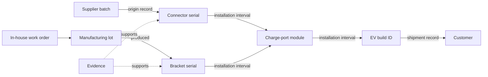

# RecallRadius implementation brief for EV vehicle assembly

> Current domain: **EV vehicle assembly**, including purchased components and parts manufactured in-house. Read [EV assembly scope](EV_ASSEMBLY_SCOPE.md) for the demo, sourcing model, public data and verified hackathon fit. The proposed contract is `assembly-quality-v4`; source migration and EV fixtures are still implementation work. Earlier robotics fixtures remain labelled regression examples, not the EV demo.

Active scope: `assembly-quality-v4`. Build an internal issue, resolution and learning workspace for an EV vehicle assembler using both supplier components and parts manufactured in-house. Operators report issues; quality and engineering teams investigate and verify fixes; a quality/operations leader reviews process and supplier trends.

This is an updated build proposal, not new market-validation research or a completed application. Follow `docs/SHARED_CONTRACT.md` for the exact DTOs, APIs, ownership and fixture. The earlier research PDF describes a different domain and is not the active assembly specification.

## Primary product story

An operator manually reports a charge-port alignment problem and marks the module, EV build and inspection station. The issue is saved in Neo4j and assigned for investigation. The graph shows both the purchased connector origin and the internally manufactured bracket lot/work order; reviewed evidence determines the cause. A graph query finds a relevant verified resolution from an earlier issue, explaining its part revision, process context and evidence. The new team reviews applicability, applies a new fix version, records verification and closes the issue. That new result can inform a later case.

The app separates the reporting team from the current owner and confirmed causal team. Likewise, supplier linkage, suspected supplier cause and confirmed supplier fault are distinct. Insights let users drill from team/process/supplier metrics to the underlying records. A user can create and update an issue without an import or AI call.

The primary demo is issue -> assignment -> prior verified fix -> new application and verification -> persistent reuse -> evidence-linked analytics. Component tracing supports the issue's context and impact rather than controlling how every issue must originate.

## Earlier supporting assembly regression story

The encoder/robot case below is retained only for testing tracing invariants. The active EV scenario and sourcing requirements are in docs/EV_ASSEMBLY_SCOPE.md. Do not use robotics labels in the EV product pitch.

A supplier flags possible test failures in rotary encoder batch ENC-B17. The assembler needs to identify which encoder serials came from that batch, which joint modules and robotic arms contain them, where the units are, and which customers received them. A replacement record may remove a part from a current configuration while leaving a historical engineering-review question. A missing batch certificate must remain visible.

The proposed commercial starting point is a bounded pilot: one facility, a few manufacturing teams, one process/part family and a named quality reviewer. Users can enter live issues manually and optionally import historical cases. Test investigation effort, verified fix reuse, recurrence and evidence completeness before setting a subscription price. No paid demand or savings have been measured.

Manufacturing genealogy is an existing category: Siemens describes tracking actual production configurations, component records, repairs and destinations. That supports the relevance of this workflow, not a claim that it is unique. The differentiation to test is reconciling fragmented records and explaining uncertainty and configuration changes. [Siemens, January 28, 2022](https://blogs.sw.siemens.com/opcenter/manufacturing-traceability-how-your-mes-adds-product-value/).

## One-day architecture

Use the shared Next.js/TypeScript application, Zod contracts and official Neo4j driver. Qoder performs real development work. An optional schema-output AI adapter can structure an operator report or explain verified fixes retrieved from the graph. Manual creation, search and workflow transitions remain available without AI.

The primary graph links Issue to Team (reported/assigned), Station/ProcessStep, DefectType and affected entities. Issue links to CauseAssessment, FixRevision and Verification. CauseAssessment links to reviewed responsible teams/suppliers; FixRevision can derive from an earlier verified fix. Keep audit events and actor/time context so edited assignments and cause judgments remain explainable.

Use deterministic transitions with version checks. Closure requires verification of the actual applied fix version. Reuse creates a new proposal linked to its source; it does not copy a prior verification into proof that the new application succeeded. Hypotheses never enter confirmed-cause analytics.

Original submitted CSV/text records are retained with hashes and row locators. Codey normalizes reviewed records into workspace-scoped immutable revisions. Each revision contains component instances, subassembly instances, vehicle instances, supplier batches, internal manufacturing lots/work orders, installation intervals, shipments, dispositions and evidence. Save every trace with its selected root, scope, configuration cutoff, source revision and engine version.

A design BOM is useful context but cannot establish the actual serial installed. An installation should identify child, parent, slot, installation ID, start/end times and evidence. Keep batch membership distinct from containment. Graph links such as common part number or crate membership do not imply that the suspect part was installed.

## Correctness choices

For current tracing, use accepted relationships active at the selected configuration time and deduplicate reached physical entity IDs. For historical tracing, carry the intersection of installation intervals through every hop. Node-only visited logic may discard a second path with a different valid interval; retain interval-aware traversal state. An empty interval means the path never existed as a complete physical assembly.

Use finite traversal/time budgets. If exceeded, return incomplete execution with an explanation. Enforce unambiguous identities, required fields, parent/slot non-overlap and cycle checks for overlapping intervals. Conflicting edits to a known installation require review; exact repeated records should be idempotent.

An acknowledged unknown batch origin is a data gap, not automatically a reason to hide the entire record. The trace can finish with unresolved evidence. Scan the declared part-family cohort for those gaps independently of known batch membership.

One row represents one serial. Keep vehicle counts separate from component counts. Two suspect components inside one vehicle produce two explanation paths and one vehicle count. Current unit location, shipment history and prior component exposure are separate facts. The legacy regression fixture only includes one outbound shipment per robot; returns, reshipments and un-serialized bulk parts require explicit later support.

Removing a suspect component does not by itself prove that the vehicle suffered no earlier effects. Keep that unit in historical review until a qualified person records a disposition. The application does not control vehicles, stop production lines, release units, issue supplier claims or send customer notices.

## Import and fixture

Begin with controlled entity, batch, installation and shipment records plus explicit location/disposition and evidence. Include a manifest for the expected records. An omitted replacement or shipment can change the conclusion, so rejected/missing rows must be visible.

`docs/reference/assembly/assembly_reference_case.py` creates two legacy robotics JSON revisions, concise oracle results and CSV exports. Codey must add separately identified EV fixtures for the new sourcing and vehicle fields. Its reference record is authoritative for the synthetic serials and times. The script has passed 23 checks; those are Python fixture checks, not application, Neo4j, security or real-hardware validation.

The late evidence only resolves E900's supplier-batch provenance. It expands current shipped robots/customers from two to three, while onsite robots remain one. R006's replacement history and R004's crate-only relationship remain unchanged. The full expected table is in the shared contract.

## Issue inputs, analytics and reference data

The user can create/edit an issue, select a serial/station/process location, add comments or evidence, assign a team, record cause hypotheses and verify a fix. Provide manual team/supplier/station directory entry as well as seeded demo catalogs. Unknown serial relationships remain unconfirmed rather than fabricated. Drawing annotations on CAD/photos is later work; selected items and evidence notes meet the one-day scope.

Separate detection area, assignment and causal area in reports. Return distinct issue counts, current backlog, confirmed-cause breakdowns and repeat defect families with matching drilldown filters. Rates require complete inspection/production opportunity cohorts and an observation cutoff. Do not divide an arbitrary count of reports by unrelated output volumes.

`docs/reference/quality/quality_issue_reference.json` contains the manual-issue demonstration, a verified prior fix and an inspection cohort. Its validated synthetic metrics are SUP-A: four confirmed issues on three units among 20 inspected (15%); SUP-B: two on two among 10 (20%). It also includes a linked-supplier hypothesis that must not affect confirmed supplier metrics. The validation script checks reference data and arithmetic, not application lifecycle or database persistence.

## Application and UI

Ali builds the issue board/manual form, issue detail and evidence, similar-resolution panel, apply/verify workflow, and team/supplier/process insights. Assembly paths and replacement history appear in issue context. A graph is an explanation aid; issue actions, attribution labels and evidence are primary.

Zubair owns the exact HTTP routes and shared validation. He calls Codey's domain services rather than writing a second issue/analytics or trace engine. His AI adapter proposes structured fields or summarizes graph-retrieved evidence; confirmations select canonical identities. It never confirms causes, creates accepted installations or closes issues from a guess.

All credentials stay on the server. Scope data by workspace and revision, and document the single-workspace synthetic identity. Authentication, retention, access audit and restore testing are pilot requirements, not implied by a demo. Use explicit mocks for independent development and disable them for final integration.

## Delivery order

Agree the v4 contract and foundation first. Codey builds manual issue persistence -> verified-fix retrieval -> cause-aware insights -> lifecycle checks, then adds assembly context. Ali builds New Issue/detail -> resolution/verification -> insights/drilldown, then adds assembly views. Zubair builds contracts/catalogs -> issue APIs -> workflow validation -> optional AI -> final real-service integration.

Merge the three feature branches only at the end. The first final gate is a real manual issue saved and retrieved from Neo4j, assigned, resolved with a new verified fix, and reused on a later issue, with correct team/supplier drilldown. Then verify the included assembly context, old-run preservation and explicit errors. Defer live MES/ERP connectors, CAD, IoT, predictive failure models, full CAPA/8D, general engineering change management and deployment polish.
