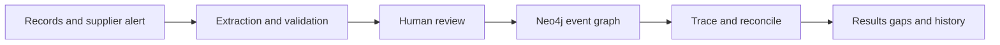

# RecallRadius Build Research

## The product to build

Build RecallRadius as a recall investigation and readiness workspace for food co-packers producing several customer brands. It should reconstruct reviewed lot relationships from existing records, trace a suspect ingredient through splitting and rework, and explain which inventory and shipments enter the investigation. Its distinctive promise should be visible evidence gaps and reproducible scope changes.

The first buyer to test is a plant owner or operations leader, with the quality assurance or food safety manager as the daily user and decision owner. Prioritize one facility using spreadsheets alongside an ERP or warehouse system, with real rework and repeated customer traceability requests. The recurring product is readiness and record reconciliation; an actual recall is an occasional high-pressure use case.

| Decision | Recommended choice |
| --- | --- |
| Hackathon entry | Track A - Developers (Builder), plus the separate Neo4j bonus. |
| Essential sponsor tools | Qoder IDE for development; Neo4j Aura for actual event and lot traversal. |
| Runtime AI | One schema-constrained extraction adapter for an alert or mapping proposal, followed by review. |
| One-day scope | One site, a fixed set of CSV schemas, a synthetic supplier alert, trace results, evidence and a version comparison. |
| Paid pilot | One co-packer, historical mock incidents, limited source systems and a named QA reviewer. |

The organizer's Builder rubric weights Qoder/AI use and execution at 25% each, innovation at 20%, and impact and story at 15% each. Neo4j has a separate bonus for substantive graph use; it is not a third track. No maximum tool count was found. The smaller stack is a delivery choice, not an eligibility restriction.[^1][^2]

The central demo should open with a supplier alert for ingredient lot T17. The graph reaches three finished lots through mixing, splitting and rework. One other batch has an unknown origin. A newly recovered batch sheet connects that batch to T17, expanding the customer scope. Judges see a causal chain, quantities, original evidence and a preserved earlier result.

This research includes an executable Python reference case with 22 passing checks. It verifies the proposed synthetic accounting and graph semantics, not a completed product. No Neo4j application, live model integration, customer pilot, food-safety validation or performance benchmark was completed as part of this research.

Evidence was reviewed on September 12, 2026. Findings below distinguish official requirements, vendor-described capabilities, a verified synthetic example and proposed product decisions. Customer demand, price and integration effort remain hypotheses requiring direct validation.

## Market evidence and the three gaps to test

FDA's 2026 tabletop exercises involved 15 volunteer companies across six supply-chain scenarios. Most responded within 24 hours, yet the report identified incomplete or inconsistent lot-code sources, missing event information and uneven information sharing. FDA emphasized coordination between trading partners. The exercises were simplified records requests, not mock outbreaks, and their small sample is not representative of the industry. This supports a data-readiness hypothesis, not a market-size estimate.[^3]

| Existing option | Verified capability | Product implication |
| --- | --- | --- |
| Wherefour | Raw-to-finished lot genealogy, rework records, customer shipment details and exports.[^4] | Small manufacturers and rework are already served. Rework alone is not novel. |
| Trustwell FoodLogiQ | Lot-level removal workflows, mock withdrawals, notifications and progress tracking.[^5] | A recall dashboard or mock-recall button is already available. |
| Existing records and staff | The customer's current combination of systems, files and review procedures. | Measure against the complete workflow, including import and correction time. |

Gap 1 - reconstruction across systems: propose a reviewed link between a supplier lot in a receiving file, internal production lots, rework logs and outbound shipment lines. The opportunity is a fast, constrained overlay where a customer's current systems fail to join those records reliably. Published competitor material does not establish that incumbents cannot do this.

Gap 2 - explicit uncertainty: show missing origin records, unresolved identity matches and unreconciled quantities alongside known material paths. A user should see why a result is incomplete and exactly which record would resolve it. Test this with messy historical customer data, not only a clean demonstration graph.

Gap 3 - a reusable drill-to-incident history: use routine reconciliation and mock incidents to build reviewed mappings, then freeze each real investigation run so later evidence produces an explainable change. The subscription hypothesis is recurring operational preparation, rather than access to an emergency-only search tool.

A credible story already exists in the public record: an October 2025 Kroger notice followed a supplier's recall of pasta supplied by another company, with the scope expanding after an earlier notice. FDA now labels that recall completed and terminated. It is a historical illustration of a supplier cascade, not an active alert or evidence that RecallRadius would have prevented it.[^6]

The potential defensibility is a library of reviewed import mappings, reliable exception handling and integration into QA work. A graph database and an AI prompt are available to competitors. If the prospective buyer already gets complete, explainable results from an incumbent without substantial manual work, this is a poor pilot target.

## Data access and regulatory boundaries

The first jurisdiction should be U.S. FDA-regulated food manufacturing, with applicability reviewed for the actual facility and products. FDA's Food Traceability Rule concerns specified foods and applicable exemptions, not every food product. Its current page distinguishes a proposed July 20, 2028 compliance extension from Congress's direction not to enforce before that date. Do not pitch an immediate 2026 enforcement deadline.[^7]

The rule links key data elements to critical tracking events and can require records within 24 hours, or another reasonable time agreed by FDA. FDA offers an illustrative sortable spreadsheet; its exact template is not mandatory. A hackathon export should be described as an investigation report, not a certified regulatory submission.[^7]

A traceability lot code is tied to the records of its source, and the source identifies where that code was assigned. Preserve both the external code and source identity, plus the original document. An internal UUID does not replace those business fields; receiving and shipping should not silently rename a regulatory lot.[^8]

| Records to obtain | What must be available |
| --- | --- |
| Receiving and lot master | Supplier/source identity, item, original lot code, receipt, date, quantity, unit and source record. |
| Actual production and rework | Event identity/time, every consumed input lot, output lot, quantity, unit, site and evidence. A recipe is insufficient. |
| Shipments and stock | Distinct shipment lines, direct consignees, quantities, dates, current inventory positions, disposal and returns records. |
| Investigation context | Affected root identifiers, site/time envelope, relevant inventory cutoff and QA decisions about broader exposure. |
| Reconciliation manifest | Which expected records were supplied, rejected or missing across the selected cohort, including disconnected lots. |

Public recall feeds cannot supply a co-packer's private genealogy. openFDA's food enforcement endpoint contains publicly releasable recall records dating from 2004 and is updated weekly. Use it later for contextual alert discovery. Customer production and shipment records remain a separate, essential input.[^10]

A recall plan can involve direct-consignee and public notification, effectiveness checks and product disposition; FDA describes those responsibilities separately from traceability-rule readiness.[^9] RecallRadius should prepare evidence and candidate actions for the designated QA team. It should not autonomously decide a recall, issue notices, release stock or modify warehouse holds.

For the hackathon, use fictional records only. Before a pilot, agree data ownership, retention, access, source-system authority and the customer's operating procedure. Sanitized historical data and a qualified reviewer are gating inputs. No amount of extraction quality can recover an input lot that was never recorded.

## The trace contract must be precise

GS1 EPCIS offers a useful event model. Its current artefact distribution is 2.0.1. Transformation events connect consumed inputs to produced outputs; any input may contribute to each output, including across events sharing a transformation identifier. Aggregation describes grouping, such as items in a container. Use these distinctions to inform the internal model; a one-day implementation should not claim EPCIS conformance.[^11][^12]

| Result | Meaning in RecallRadius |
| --- | --- |
| Traced potential impact | A reviewed material path connects the selected suspect lot to this lot or shipment. Display its evidence path. |
| Unresolved scope | Relevant records, identity, balances or exposure decisions are incomplete. Show missing items and a review owner. |
| No recorded material path | No path was found within the reviewed data and explicit scope. This does not mean the product is safe. |

Recommended rule: mixing and rework conservatively propagate the investigation to every output of the affected event. Do not estimate safety from a small ingredient percentage or apparent dilution. A more precise allocation needs actual, reviewed physical segregation records. Lot-level input evidence generally cannot justify releasing part of that same lot.

Sharing a pallet, SKU, brand, supplier or site must not itself create a material-incorporation edge. Possible cross-contact is a separate, case-specific QA hypothesis that may broaden investigation scope. A graph without cross-contact data cannot establish absence of that hazard. Keep this distinction visible in the product language.

Count inventory positions and shipment lines once by their stable identities, even if multiple paths reach them. Report current onsite candidate stock, shipped quantities and already-disposed quantities separately. Rework is not new stock to add a second time after it has been consumed. Returns belong in their own movements and should not erase prior outbound history.

Run quality checks across the entire selected site/time cohort, including disconnected records. Otherwise, a missing link can make a genuinely relevant shipment disappear from the graph. Unknown-origin flags can coexist with a known path; do not replace one with the other. A failed or truncated query means the run is incomplete, not that its result is empty.

Use distinct physical lot versions and manufacturing events so repeat use of a SKU does not create a cycle. Reject impossible references, conflicting duplicate event IDs and unsupported units. Retain event time separately from recording time. Corrections should create a new accepted revision, with each trace preserving the data revision, engine version, scope and reviewer decisions that produced it.

For real plants, quantity checks need approved conversions, process yields, losses and inventory cutoffs. The supplied reference case deliberately uses integer kilograms and explicitly recorded waste. Its closed-process arithmetic should not be generalized to drying, moisture changes, mixed measurement units or unrecorded losses.

## A small, credible technical architecture

Use Next.js and TypeScript for the interface and server routes, Zod for input validation, and the official Neo4j JavaScript driver. Keep original CSVs or pasted source text with hashes and row references. Store accepted event records and an immutable graph projection for each small demo revision. Avoid a second database unless a specific requirement emerges.[^14][^23][^24]

The core graph contains LotSnapshot, MaterialEvent, ShipmentLine, InventoryPosition, SourceRecord, Evidence and TraceRun nodes. Material paths follow INPUT_TO and OUTPUT_LOT relationships. Customer and brand nodes organize results; container membership uses separate relationships. Every node belongs to a workspace and revision. Stable business identities remain separate from graph projection IDs.

Traverse through fixed, parameterized queries. A server-side frontier loop can follow distinct output lots while maintaining a visited set and collecting event witnesses. Compare the result to unresolved records in the scoped cohort, then compute quantities from the movement ledger. Do not sum quantities along graph paths. Neo4j is justified here by changing, inspectable many-to-many lineage; SQL remains technically possible.

Qoder should perform real development work: schema scaffolding, graph-query iteration, UI changes and meaningful tests, with a short record of the accepted work. Agent Mode supports project editing, commands and MCP-assisted workflows.[^13] Optional read-only Neo4j MCP can help inspect the synthetic graph during development. Its read-only setting limits exposed tools, not all access risks.[^16][^17]

AI should propose the suspect item/lot from a pasted alert, or map unfamiliar column names to an approved schema. Require a source span or row for each proposed field; a human confirms identity and relationships. Use one available structured-output API. Gemini 3.8 Flash is a documented current option, but switchability and validation matter more than a model brand.[^20][^22]

Schema-valid output can still be semantically wrong. Block unsupported values, preserve unknowns, and make extraction failure recoverable through manual entry. Imported documents are data, never instructions to the application. Models should not generate executable Cypher or decide investigation scope. Keep model calls outside retryable database transactions.[^14][^20]

Use server-only secrets and a small upload limit. Composite uniqueness constraints help prevent duplicate projection identities; they do not provide tenant authorization.[^15] For a pilot, add authenticated access, enforced workspace boundaries, retention/deletion, backup-and-restore tests and access logging before accepting customer data. Keep PDF parsing and OCR optional: PDF.js can support text PDFs, while Docling is a later option for more difficult documents.[^26][^27]

## The demonstration and verified reference case

The fictional co-packer starts with 100 kg of suspect tahini T17. One batch is split into finished stock, rework, work in progress and waste. Another finished lot, F-C, receives both T17 directly and rework derived from T17. That diamond-shaped genealogy is the test for duplicate counting. All ingredients, brands and customers in this example are synthetic.

| Measure | First accepted revision | After late batch evidence |
| --- | --- | --- |
| Onsite candidate stock | 160 kg: raw 60, finished 90, WIP 10 | 190 kg: raw 60, finished 130 |
| Traced outbound shipments | 120 kg; 3 distinct lines and consignees | 180 kg; 4 distinct lines and consignees |
| Finished lots with a path | F-A, F-B, F-C | F-A, F-B, F-C, F-E |
| Unresolved finished stock | F-E: 40 kg onsite, 60 kg shipped | Its origin is resolved in this fixture |
| Already disposed | 10 kg, reported separately | 10 kg, reported separately |
| Control lot F-D | No recorded material path | Still no recorded material path |

Initially, F-E's input R-UNK has a missing origin. Its provisional 20 kg opening quantity balances recorded consumption but does not prove a receipt or origin. It remains a review item. F-C and control lot F-D share pallet P9; container membership does not make F-D a descendant of T17.

A late batch sheet records 10 kg from WIP101 mixed with 10 kg of another input to produce R-UNK. The new revision removes the provisional opening amount, consumes the 10 kg of WIP and connects F-E to T17. Onsite scope therefore increases by 30 kg, not 40 kg. Outbound scope increases by 60 kg. The first result remains unchanged and accessible.

The included reference_case.py executed 22 passing checks: both revisions' quantities and consignee counts, duplicate paths, the pallet control, unresolved origins, disposal, history preservation, exact duplicate events, conflicting duplicates, missing references, negative stock, unsupported units, imbalance, event order, cycles, repeated shipment lines and overlapping path/gap flags.

This is a small Python reference model using a complete synthetic cohort. It does not test Neo4j, API security, arbitrary production records, hazard modeling, general unit conversions or response time. Port the same cases into the actual application and run them against the real Neo4j queries before claiming end-to-end correctness.

The judge-facing interaction should have four views: import and review; the trace table with an expandable evidence path; unresolved records; and revision comparison. Give quantities and next actions the most screen space. A large animated graph alone would hide the operational decision the buyer needs to make.

## One-day delivery and practical economics

| Focused build time | Deliverable and exit condition |
| --- | --- |
| Hours 0-1 | Seed one workspace and the synthetic graph; fix identities, schema and expected counts. |
| Hours 1-3 | Implement import validation, material traversal and ledger totals. Match both reference revisions. |
| Hours 3-4.5 | Build the result table, evidence drawer and separate unresolved queue. |
| Hours 4.5-5.5 | Add one AI alert-extraction flow with mandatory review and manual fallback. |
| Hours 5.5-6.5 | Add immutable runs, late-evidence comparison and a simple investigation CSV export. |
| Hours 6.5-8 | Run integration tests, record sponsor usage, capture a backup demo and prepare the form. |

This is an eight-hour effort estimate, not the event's remaining time. If fewer than four hours are available, use fixed synthetic imports and manual lot selection. Preserve actual Neo4j traversal, evidence, uncertainty and the revision comparison. Cut OCR, connectors, alerts, messaging, GraphRAG, agent memory, full EPCIS ingestion and extra visualization polish first.

The release gate is correctness on the declared scope: every expected affected shipment appears, the control does not acquire a false material path, all missing-origin cases stay visible, and totals remain stable through duplicate paths. Use Vitest for the application rules, plus real database integration checks. Add a pilot gate for tenant isolation, restore behavior and import reconciliation. The current reference checks are a starting corpus, not certification.[^25]

Aura Free is suitable for a synthetic demonstration. The published Professional 1 GB rate is $0.09 per hour, or $65.70 for a 730-hour month; taxes and other services are separate.[^18] Free instances can pause after 72 hours of inactivity and may be deleted after more than 30 days paused. Keep reproducible seeds and check the instance before presenting.[^19]

For a transparent model-cost example, 100 extraction calls at 5,000 input and 1,000 billed output tokens each use 500,000 input and 100,000 output tokens. At the documented Gemini 3.8 Flash standard rates of $0.75 and $3.75 per million through December 31, 2026, that is $0.75. Retries, extra reasoning tokens and larger documents can change the bill; listed rates increase in 2027.[^21]

For a pilot, budget roughly $100-$200 monthly for small-scale infrastructure as a planning allowance, excluding engineering, customer onboarding and QA review. Do not mistake cheap model calls for cheap delivery. Provider data-use terms and customer confidentiality need review before sending private documents; free and paid model tiers can differ.[^21]

No deployment provider is essential to the concept. Run locally for development, capture a backup recording, and add a stable hosted demonstration if time allows. Neither a runtime LLM nor an optional hosting service should become a dependency for deterministic tracing once reviewed data is accepted.

## Judging strategy and the paid-pilot decision

The live form requires name, email, title, a description of up to 200 words, Qoder and Neo4j use answers, track choice and a LinkedIn or X post URL. GitHub is optional. There is no dedicated recording, slide or deployment field. Put the demo link, short recording and architecture explanation in the README, then include that repository in the form.[^2]

The deck lists submission at 5:00 p.m. and judging from 5:00 to 6:30 p.m. on September 12. A social post is required for prizes. No individual pitch length is stated; prepare a three-minute version and a 90-second fallback. The supplied judge kit is preparation only: nothing has been posted or submitted.[^1]

Pitch the problem in 20 seconds, demonstrate the initial trace in 45, inspect the rework path and missing origin in 40, and reveal the late-record scope change in 45. Use the remaining 30 seconds to show how Qoder contributed, why Neo4j is substantive and who would buy the workflow. This is a recommended script, not an organizer rule.

Track A is the best fit because the product's value resides in the running application and reproducible graph behavior. Track B would require a different emphasis on a Qoder Desktop Agent workflow and is a weaker match for the proposed build. For the Neo4j bonus, show a real many-to-many material path and changing traversal results; merely storing records or drawing a graph is insufficient.

Before selling a pilot, interview five QA or operations leaders about their last mock recall or supplier incident. Seek two sanitized historical data packs and one paid commitment. Ask which links were missing, who joined the records, how long the full exercise took and whether their existing system already solves it. These are proposed validation thresholds, not evidence that customers have agreed.

Test a $1,500 four-week pilot for one facility, two agreed export formats and five historical challenge cases. Offer onboarding, reviewed mappings, a shadow-mode drill and a measured comparison with current work. Price specialist food-safety review separately where needed. A later $300-$750 monthly site subscription is a pricing experiment, conditional on recurrent value and support costs.

The economics must work without speculative avoided-recall savings. Saving six person-hours at $60 per hour on a quarterly drill is only $120 per month. That alone cannot justify a $600 monthly plan. Saving four additional hours of recurring weekly reconciliation would add about $1,039 monthly at the same assumed labor rate. Measure whether that work actually exists and is reduced.

Proceed if a buyer supplies usable records, a reviewer can establish expected answers, the workflow reduces total effort without hiding gaps, and someone pays for a bounded result. Reconsider if records are unavailable, onboarding remains bespoke for every customer, or an incumbent already satisfies the need. RecallRadius has an unusually strong graph demo; commercial success depends on trustworthy data access and recurring operational value.

## Sources

1. B.E.L.L.E / Qoder / Neo4j. [Hackathon organizer deck, slides 8-14](https://www.canva.com/design/DAHUt_zVr_4/As1pUraRGt4HDH2EvCtBwA/view#11). September 12, 2026. Tracks, judging weights, bonus, schedule and social-post requirement; inspected in Chrome.

2. B.E.L.L.E. [Qoder and Neo4j 9/12 Hackathon Submission](https://docs.google.com/forms/d/e/1FAIpQLSeFEB5HWuUGIKssCZD68Hl9ufNaU4abz-_hRJGbYMhlxt1jEQ/viewform). Undated; accessed September 12, 2026. Live required and optional fields; inspected in Chrome. No submission performed.

3. U.S. FDA. [Traceability Readiness Tabletop Exercises Final Report](https://www.fda.gov/media/192993/download?attachment=). 2026; accessed September 12, 2026. Primary exercise findings and limitations; 15 volunteers, six scenarios.

4. Wherefour. [Traceability](https://wherefour.com/traceability/). Undated; accessed September 12, 2026. Vendor-described lot genealogy, rework and shipment capabilities; not independent performance evidence.

5. Trustwell. [FoodLogiQ Recall Management](https://www.trustwell.com/products/foodlogiq/recall/). Undated; accessed September 12, 2026. Vendor-described removal, mock-withdrawal and communication workflows.

6. Kroger, published by U.S. FDA. [Kroger Voluntarily Recalls Two Varieties of Deli Pasta Salads](https://www.fda.gov/safety/recalls-market-withdrawals-safety-alerts/kroger-voluntarily-recalls-two-varieties-deli-pasta-salads-because-possible-health-risk). October 4, 2025; status checked September 12, 2026. Historical supplier cascade. FDA now marks the recall completed and terminated.

7. U.S. FDA. [FSMA Final Rule: Additional Traceability Records for Certain Foods](https://www.fda.gov/food/food-safety-modernization-act-fsma/fsma-final-rule-requirements-additional-traceability-records-certain-foods). Current page; accessed September 12, 2026. Scope, records, template and timing. Current timing notice takes precedence over residual January 2026 wording elsewhere on the page.

8. U.S. FDA. [Traceability Lot Code](https://www.fda.gov/food/food-safety-modernization-act-fsma/traceability-lot-code). Current page; accessed September 12, 2026. Code, source and source-reference concepts and links to business records.

9. U.S. FDA. [FDA Calls on Food Industry Leaders to Strengthen Recall Compliance and Ensure Recall Effectiveness](https://www.fda.gov/food/recalls-outbreaks-emergencies/fda-calls-food-industry-leaders-strengthen-recall-compliance-and-ensure-recall-effectiveness). Current page; accessed September 12, 2026. Recall-plan responsibilities, notifications, checks and disposition.

10. openFDA / U.S. FDA. [Food Enforcement API](https://open.fda.gov/apis/food/enforcement/). Current documentation; accessed September 12, 2026. Public recall record coverage and weekly refresh cadence.

11. GS1. [EPCIS / CBV 2.0.1 Artefacts](https://ref.gs1.org/standards/epcis/artefacts). Current distribution; accessed September 12, 2026. Official standard, JSON schemas, OpenAPI and related artefacts.

12. GS1. [EPCIS Standard, 2.0.1 distribution](https://ref.gs1.org/standards/epcis/2.0.1/). Underlying standard ratified June 2022; accessed September 12, 2026. Transformation and grouping semantics, especially section 7.4.5. Internal design is not a conformance claim.

13. Qoder. [Agent Mode](https://docs.qoder.com/user-guide/chat/agent). Current documentation; accessed September 12, 2026. Project editing, command execution and MCP-assisted development.

14. Neo4j. [Run your own transactions - JavaScript Driver Manual](https://neo4j.com/docs/javascript-manual/current/transactions/). Current documentation; accessed September 12, 2026. Parameterized operations, managed transactions and retry-safe callbacks.

15. Neo4j. [Create constraints - Cypher Manual](https://neo4j.com/docs/cypher-manual/current/schema/constraints/create-constraints/). Current documentation; accessed September 12, 2026. Composite property uniqueness; separate from authorization.

16. Neo4j. [Neo4j MCP Configuration reference](https://neo4j.com/docs/mcp/current/configuration/). Current documentation; accessed September 12, 2026. Read-only tool setting for optional synthetic-data development access.

17. Neo4j. [Neo4j MCP Introduction](https://neo4j.com/docs/mcp/current/). Current documentation; accessed September 12, 2026. Graph tools and prerequisites; optional for the proposed application.

18. Neo4j. [Neo4j pricing](https://neo4j.com/pricing/). Rates accessed September 12, 2026. Aura Free and Professional 1 GB hourly rate; recheck before purchase.

19. Neo4j. [Aura instance actions](https://neo4j.com/docs/aura/managing-instances/instance-actions/). Current documentation; accessed September 12, 2026. Free instance inactivity and paused-instance lifecycle.

20. Google AI for Developers. [Structured outputs](https://ai.google.dev/gemini-api/docs/structured-output). Updated September 2, 2026; accessed September 12, 2026. Schema-constrained output and the need for semantic validation.

21. Google AI for Developers. [Gemini Developer API pricing](https://ai.google.dev/gemini-api/docs/pricing). Rates accessed September 12, 2026. 3.8 Flash standard token prices, 2027 change and free/paid data-use distinction.

22. Google AI for Developers. [Gemini deprecations](https://ai.google.dev/gemini-api/docs/deprecations). Current schedule; accessed September 12, 2026. 3.8 Flash release and current published lifecycle status.

23. Next.js. [Getting Started: Route Handlers](https://nextjs.org/docs/app/getting-started/route-handlers). Current documentation; accessed September 12, 2026. Server endpoint building block.

24. Zod. [Introduction](https://zod.dev/). Current documentation; accessed September 12, 2026. TypeScript-oriented runtime schema validation.

25. Vitest. [Getting Started](https://vitest.dev/guide/). Current documentation; accessed September 12, 2026. Suggested application test runner; not used by the Python reference harness.

26. Mozilla. [PDF.js](https://mozilla.github.io/pdf.js/). Current documentation; accessed September 12, 2026. Optional text-PDF extraction and display building block.

27. Docling project. [Advanced options](https://docling-project.github.io/docling/usage/advanced_options/). Current documentation; accessed September 12, 2026. Later document-processing option; outside the one-day critical path.

[^1]: B.E.L.L.E / Qoder / Neo4j, [Hackathon organizer deck, slides 8-14](https://www.canva.com/design/DAHUt_zVr_4/As1pUraRGt4HDH2EvCtBwA/view#11), September 12, 2026.
[^2]: B.E.L.L.E, [Qoder and Neo4j 9/12 Hackathon Submission](https://docs.google.com/forms/d/e/1FAIpQLSeFEB5HWuUGIKssCZD68Hl9ufNaU4abz-_hRJGbYMhlxt1jEQ/viewform), Undated; accessed September 12, 2026.
[^3]: U.S. FDA, [Traceability Readiness Tabletop Exercises Final Report](https://www.fda.gov/media/192993/download?attachment=), 2026; accessed September 12, 2026.
[^4]: Wherefour, [Traceability](https://wherefour.com/traceability/), Undated; accessed September 12, 2026.
[^5]: Trustwell, [FoodLogiQ Recall Management](https://www.trustwell.com/products/foodlogiq/recall/), Undated; accessed September 12, 2026.
[^6]: Kroger, published by U.S. FDA, [Kroger Voluntarily Recalls Two Varieties of Deli Pasta Salads](https://www.fda.gov/safety/recalls-market-withdrawals-safety-alerts/kroger-voluntarily-recalls-two-varieties-deli-pasta-salads-because-possible-health-risk), October 4, 2025; status checked September 12, 2026.
[^7]: U.S. FDA, [FSMA Final Rule: Additional Traceability Records for Certain Foods](https://www.fda.gov/food/food-safety-modernization-act-fsma/fsma-final-rule-requirements-additional-traceability-records-certain-foods), Current page; accessed September 12, 2026.
[^8]: U.S. FDA, [Traceability Lot Code](https://www.fda.gov/food/food-safety-modernization-act-fsma/traceability-lot-code), Current page; accessed September 12, 2026.
[^9]: U.S. FDA, [FDA Calls on Food Industry Leaders to Strengthen Recall Compliance and Ensure Recall Effectiveness](https://www.fda.gov/food/recalls-outbreaks-emergencies/fda-calls-food-industry-leaders-strengthen-recall-compliance-and-ensure-recall-effectiveness), Current page; accessed September 12, 2026.
[^10]: openFDA / U.S. FDA, [Food Enforcement API](https://open.fda.gov/apis/food/enforcement/), Current documentation; accessed September 12, 2026.
[^11]: GS1, [EPCIS / CBV 2.0.1 Artefacts](https://ref.gs1.org/standards/epcis/artefacts), Current distribution; accessed September 12, 2026.
[^12]: GS1, [EPCIS Standard, 2.0.1 distribution](https://ref.gs1.org/standards/epcis/2.0.1/), Underlying standard ratified June 2022; accessed September 12, 2026.
[^13]: Qoder, [Agent Mode](https://docs.qoder.com/user-guide/chat/agent), Current documentation; accessed September 12, 2026.
[^14]: Neo4j, [Run your own transactions - JavaScript Driver Manual](https://neo4j.com/docs/javascript-manual/current/transactions/), Current documentation; accessed September 12, 2026.
[^15]: Neo4j, [Create constraints - Cypher Manual](https://neo4j.com/docs/cypher-manual/current/schema/constraints/create-constraints/), Current documentation; accessed September 12, 2026.
[^16]: Neo4j, [Neo4j MCP Configuration reference](https://neo4j.com/docs/mcp/current/configuration/), Current documentation; accessed September 12, 2026.
[^17]: Neo4j, [Neo4j MCP Introduction](https://neo4j.com/docs/mcp/current/), Current documentation; accessed September 12, 2026.
[^18]: Neo4j, [Neo4j pricing](https://neo4j.com/pricing/), Rates accessed September 12, 2026.
[^19]: Neo4j, [Aura instance actions](https://neo4j.com/docs/aura/managing-instances/instance-actions/), Current documentation; accessed September 12, 2026.
[^20]: Google AI for Developers, [Structured outputs](https://ai.google.dev/gemini-api/docs/structured-output), Updated September 2, 2026; accessed September 12, 2026.
[^21]: Google AI for Developers, [Gemini Developer API pricing](https://ai.google.dev/gemini-api/docs/pricing), Rates accessed September 12, 2026.
[^22]: Google AI for Developers, [Gemini deprecations](https://ai.google.dev/gemini-api/docs/deprecations), Current schedule; accessed September 12, 2026.
[^23]: Next.js, [Getting Started: Route Handlers](https://nextjs.org/docs/app/getting-started/route-handlers), Current documentation; accessed September 12, 2026.
[^24]: Zod, [Introduction](https://zod.dev/), Current documentation; accessed September 12, 2026.
[^25]: Vitest, [Getting Started](https://vitest.dev/guide/), Current documentation; accessed September 12, 2026.
[^26]: Mozilla, [PDF.js](https://mozilla.github.io/pdf.js/), Current documentation; accessed September 12, 2026.
[^27]: Docling project, [Advanced options](https://docling-project.github.io/docling/usage/advanced_options/), Current documentation; accessed September 12, 2026.
